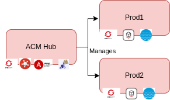

# Virtualization Migration Factory Reference Implementation
A well-architected virtualization migration factory deployment aimed at making it easy for everyone to get started with this kinds of efforts.

<!-- TOC -->

- [Virtualization Migration Factory Reference Implementation](#virtualization-migration-factory-reference-implementation)
  - [Getting Started](#getting-started)
  - [High-Level Architecture](#repo-structure)
  - [GitOps Approach](#gitops-approach)
  - [Ansible Automation Platform](#ansible-automation-platform)    

<!-- TOC -->

## Getting Started 

You will have to customize the following before you can get started:

- The storage layer, this incudes defining CSI drivers and storage classes. See more [here](./storage.md)
- The additional network layer configurations. This includes defining NodeNetworkConfigurationPolicies (NNCP) and NodeNetworkAttachment (NAD) for the VMs. See more [here](./networking.md).
- If you decide to create clusters via ACM, then you also have to customie the  setup for the clusters you create. Here we have two clusters [etl4](./clusters/hub/overlays/cluster-etl4/) and [etl6](./clusters/hub/overlays/cluster-etl6/). This includes, BMHs, initial network configuration for the, VIPs, certificates, DNS entries. See more about it in the [cluster provisioning](#cluster-provisioning) section.


Once you have performed the above customization you can run the following:

```sh
export gitops_repo=https://github.com/AsherShoshan/openshift-virtualization-gitops.git #<your newly created repo>>
export cluster_name=hub #<your hub cluster name, typically "hub">
export cluster_base_domain=$(oc get ingress.config.openshift.io cluster --template={{.spec.domain}} | sed -e "s/^apps.//")
export platform_base_domain=${cluster_base_domain#*.}
oc apply -f .bootstrap/subscription.yaml
oc apply -f .bootstrap/cluster-rolebinding.yaml
sleep 60
envsubst < .bootstrap/argocd.yaml | oc apply -f -
sleep 30
envsubst < .bootstrap/root-application.yaml | oc apply -f -
```

## High-Level Architecture

This repository automates via gitops the deployment of the following architecture:



We can see that we will have three clusters:

1. A Hub Cluster with ACM, AAP and MTV to managed the other clusters and coordinate migration waves
2. two managed cluster, called Prod1 and Prod2 with OpenShift Virtualization, OADP to run Virtual Machines.


## GitOps Approach

This repository is based on the [CoP ArgoCD Model](https://github.com/redhat-cop/gitops-standards-repo-template) approach for controlling the configuration.
See [here](./gitops-approach.md) for more information on how to use this repo.

## Ansible Automation Platform

TODO

